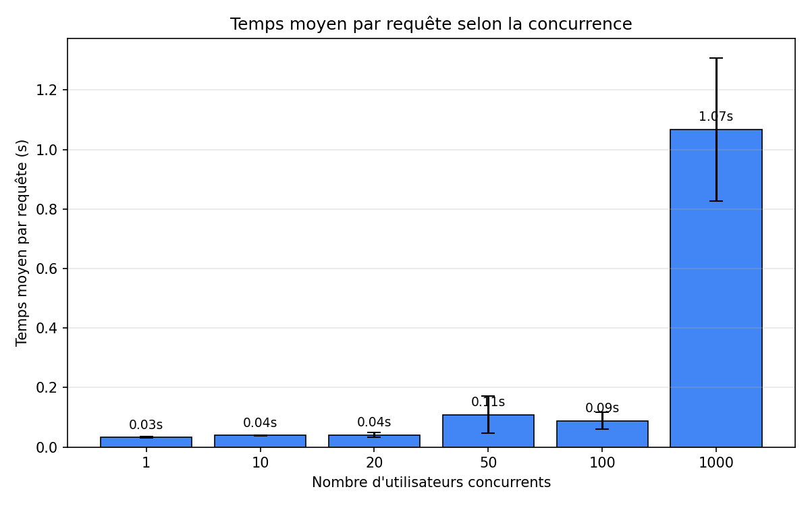
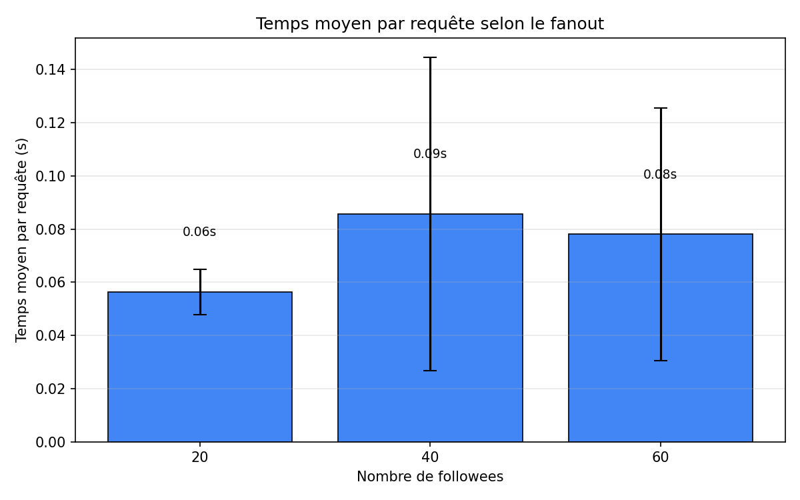

# TinyInsta — Est-ce que ça scale ?

TP de passage à l'échelle sur [TinyInsta](https://github.com/momo54/massive-gcp), une mini app type Instagram déployée sur Google App Engine avec Datastore.

**URL de l'app** : https://tinyinsta-gcp.ew.r.appspot.com

## Expérience 1 — On augmente le nombre d'utilisateurs simultanés

On fixe les données (1000 users, 50 posts/user, 20 followers chacun) et on fait varier le nombre de personnes qui utilisent l'app en même temps : 1, 10, 20, 50, 100 et 1000.

Pour chaque config, on lance 3 runs de 60 secondes avec Locust et on mesure le temps moyen pour charger une timeline.



## Expérience 2 — On augmente le nombre de followees

Cette fois on fixe 50 utilisateurs simultanés et 100 posts/user, et on fait varier le nombre de personnes que chaque user suit : 20, 40 puis 60.



## Ce qu'on observe

### Concurrence

Jusqu'à 20 users simultanés, ça tourne bien (~30-40ms par requête). À 50 ça commence à ralentir un peu, et à 1000 le temps de réponse monte à plus d'une seconde.

C'est logique car quand il y a beaucoup de monde d'un coup, App Engine doit lancer de nouvelles instances, et le datastore a un peu de mal parce que chaque requête de timeline génère 20 sous-requêtes (une par followee) qui sont fusionnées côté serveur.

Par contre l'app ne plante pas elle répond juste plus lentement.

### Fanout

Plus un user suit de monde, plus la timeline est longue à charger. On passe de ~0.11s pour 20 followees, à ~2.14s pour 40, et ~2.93s pour 60.

C'est logique car la clause `IN` de lance une sous-requête par followee puis fusionne les résultats. Suivre 60 personnes = 3x plus de sous-requêtes que 20, et le temps de réponse explose en conséquence. La croissance est exponentielle, ce qui montre bien que cette approche ne scale pas du tout sur le fanout.

### Du coup, ça scale ou pas ?

Ça scale **en partie**. App Engine ajoute bien des instances quand la charge monte, donc l'app ne tombe jamais. Mais la façon dont la timeline est calculée (lecture à la volée avec une requête `IN`) est un vrai goulot d'étranglement.

Pour que ça scale mieux, il faudrait par exemple :
- Pré-calculer les timelines à chaque nouveau post 
- Mettre du cache sur les timelines les plus demandées
- Mieux paginer les résultats

Certaines erreurs ont pu être observées (ex: C onnectionRefused, DNS) peuvent provenir de l’environnement de test et non uniquement de l’application.
## Structure du repo

```
out/
├── conc.csv       # Résultats expérience 1
├── conc.png       # Graphique expérience 1
├── fanout.csv     # Résultats expérience 2
└── fanout.png     # Graphique expérience 2
```